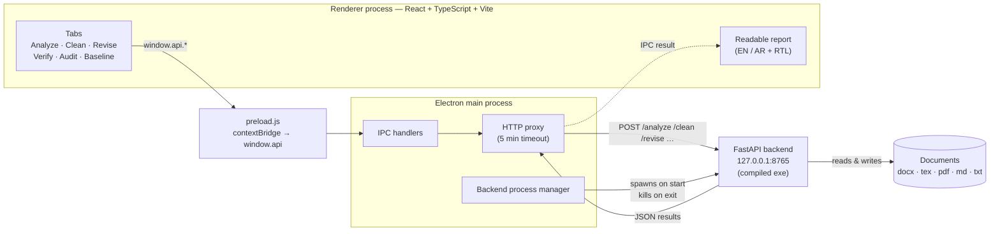
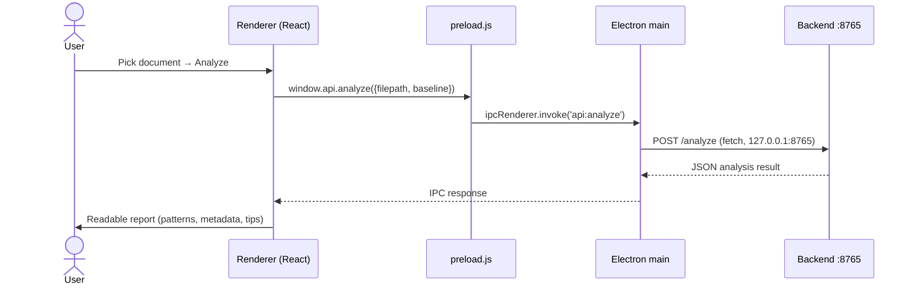
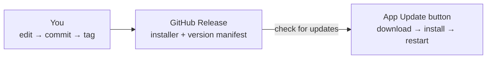

# ai-tell

**Evidence-based authorship transparency and revision tool.**

ai-tell is a desktop application that audits documents for provenance signals and writing patterns (such as stylometric markers and hidden Unicode characters), helps you clean or revise them, and shows the results as a plain-language report instead of raw JSON.

> **Languages:** English 🇬🇧 · العربية 🇸🇦 — full UI translation with right-to-left (RTL) layout.

---

## Features

| Tab | What it does |
|-----|--------------|
| **Analyze** | Provenance & style audit: document statistics, sentence variety, style markers, detected writing patterns with explanations and tips, metadata (DOCX core, C2PA signatures, EXIF/XMP), and hidden Unicode characters. Optional author-baseline comparison. |
| **Clean** | Removes identifying metadata from a document and writes a cleaned copy. |
| **Revise** | Generates revision suggestions for a document, with resumable sessions. |
| **Verify** | Before/after comparison between an original and a revised document. |
| **Audit** | Bundles analysis, verification, and logs into an exportable audit package. |
| **Baseline** | Builds an author style profile from 3–5 sample documents for future comparisons. |

**Readable reports** — analysis results are rendered as an assessment banner, summary statistics, pattern explanations, and document information. The raw JSON stays available in a collapsible section.

**Supported input formats:** `.docx` `.tex` `.pdf` `.md` `.txt`

---

## Architecture

The app is a three-layer desktop architecture: an Electron shell, a React UI, and a local Python analysis engine.



### What happens when you run an analysis



**Security model:** the renderer runs with `contextIsolation: true` and `nodeIntegration: false`. The UI can only reach the system through the explicit `window.api` surface exposed by `preload.js`; all backend traffic is proxied over `localhost` from the main process.

---

## Tech stack

| Layer | Technology |
|-------|-----------|
| Desktop shell | Electron |
| UI | React 18, TypeScript, Vite, lucide-react |
| Backend | FastAPI + Uvicorn (distributed as a compiled PyInstaller executable) |
| Document parsing | python-docx, PyMuPDF, and related libraries (bundled in the backend) |

---

## Repository structure

```
ai-tell/
├── package.json                 # Electron app manifest (main: electron/main.js)
├── assets/                      # App icons
├── electron/
│   ├── main.js                  # Backend process manager · IPC · HTTP proxy
│   ├── preload.js               # contextBridge → window.api
│   └── renderer/
│       ├── src/                 # React UI (App.tsx, i18n, styles)
│       └── dist/                # Build output (gitignored)
└── python/
    └── dist/
        └── aitell-backend.exe   # FastAPI backend — vendored binary (see below)
```

> **About the backend:** the Python analysis engine ships only as a compiled executable; its source is not part of this repository. The binary is tracked in git as a vendored dependency so a complete app can always be built. Development mode expects a virtualenv at `python/.venv` with `python/server.py`.

---

## Getting started

### Build the UI

Requires [Node.js](https://nodejs.org/) 18+.

```bash
cd electron/renderer
npm install
npm run build      # tsc + vite → electron/renderer/dist/
```

`npm run dev` starts the Vite dev server (the app loads `http://localhost:5173` when run with `NODE_ENV=development`).

### Run the app

The packaged app is `ai-tell.exe` with resources in `resources/`:

```
resources/
├── app.asar                # packaged source (main.js, preload.js, renderer/dist)
└── python/
    └── aitell-backend.exe  # started automatically on port 8765
```

To deploy a new build into an installed app (current manual process):

```powershell
# 1. close ai-tell, then from the repo root:
Move-Item electron\renderer\node_modules ..\nm.aside
npx @electron\asar pack . ..\app.asar
Move-Item ..\nm.aside electron\renderer\node_modules

# 2. replace the installed archive and relaunch
Copy-Item ..\app.asar "<install-path>\resources\app.asar" -Force
```

Automated installer packaging is on the roadmap (see below).

---

## Version control & releases

```bash
git add -A
git commit -m "Describe what changed and why"
git push
```

- Bump `version` in the root `package.json` when you cut a release.
- Keep `main` green: run `npm run build` in `electron/renderer` before pushing UI changes.

### Planned: in-app updates

The target release flow — users press **Update** in the app header and the new version installs itself:



---

## Roadmap

- [ ] In-app **Update** button backed by GitHub Releases
- [ ] Automated Windows installer packaging (electron-builder) and release CI
- [ ] Wire the Clean/Revise option checkboxes through to the backend API calls
- [ ] LLM-assisted revision via a local Ollama server
- [ ] Persist the language choice (English / Arabic) across restarts
